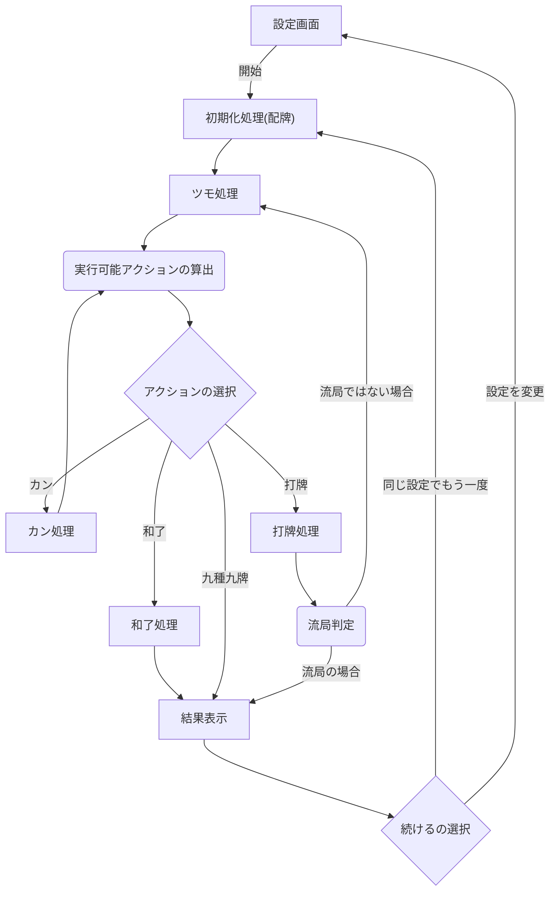

# mahjong-practice

一人麻雀練習機

# 開発環境

| 名称       | バージョン | 備考                 |
| ---------- | ---------- | -------------------- |
| Node.js    | 18.16.0    | LTS                  |
| Yarn       | 1.22.19    | パッケージ管理ツール |
| TypeScript | 5.x.x      |                      |

# フローチャート

# 牌画像

- [麻雀豆腐](https://majandofu.com/mahjong-images)
